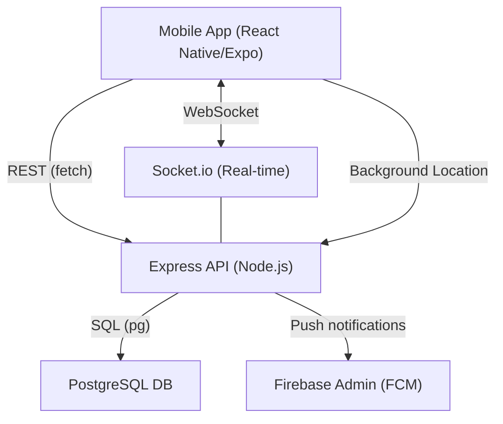

# ATMS - Future Soldiers Mobile Application

A premium, real-time tactical monitoring system for security-focused organizations. This project includes a React Native (Expo) mobile frontend and a Node.js/Express backend API.

---

## 🚀 Project Overview

The **Future Soldiers** app empowers field teams with:
- **Real-time Location Tracking**: Continuous GPS updates shared with a command center.
- **Instant Push Notifications**: Alerts for zone breaches, emergencies, and assignments via FCM.
- **In-app Alert Center**: Centralized notification management and history.
- **Health Monitoring Dashboard**: Live vitals tracking (Heart Rate, SpO2, Temp).
- **Mission & Assignment Management**: Real-time tasking and acknowledgment.
- **Offline Support**: Notification preferences and alert history stored locally.

---

## 🛠️ Technical Stack

### Frontend (React Native / Expo)
- **Framework**: Expo SDK 53.0.20, React 19
- **Navigation**: React Navigation 7
- **State/Storage**: AsyncStorage, Context API
- **Maps**: React Native Maps
- **Real-time**: Socket.io Client
- **Push**: Expo Notifications, Firebase Client

### Backend (Node.js / Express)
- **Framework**: Express 5.1
- **Database**: PostgreSQL (pg)
- **Real-time**: Socket.io
- **Push**: Firebase Admin SDK (FCM)
- **Authentication**: Bcrypt, UUID

---

## 📐 Architecture



## ⚡ Unified Quick Start

For a complete setup and startup of both Backend and Frontend in one go, run:

```bash
chmod +x start_project.sh
./start_project.sh
```

This will:
1. Check for Node.js.
2. Install dependencies for both Backend and Frontend if missing.
3. Start the Backend API (Port 4000).
4. Start the Frontend (Expo Dev Server).

---

## 📋 Prerequisites

- **Node.js** (v18+)
- **PostgreSQL** (Port 5432/5433)
- **Expo CLI** (`npm install -g expo-cli`)
- **EAS CLI** (`npm install -g eas-cli`)
- **Android Studio / Xcode** (for emulators)

---

## 🛠️ Installation & Setup

### 1. Backend (my-api)

```bash
cd my-api
npm install
```

**Environment Variables (.env)**:
```env
PGHOST=localhost
PGUSER=your_user
PGPASSWORD=your_password
PGDATABASE=OCFA
PGPORT=5432
PORT=4000
```

**Database Setup**:
```bash
psql -U postgres -d OCFA -f database-schema.sql
# If health tables are needed:
node setup-health-tables.js
```

**Start Backend**:
```bash
npm start
```

### 2. Frontend (frontend)

```bash
cd frontend
npm install
```

**Start Frontend**:
```bash
npx expo start
```

---

## 🔥 Firebase & Notifications Setup

### 1. Configuration
- Place `google-services.json` in `frontend/android/app/`.
- Place `firebase-service-account.json` in `my-api/`.
- Update `frontend/firebase-config.js` with your keys.

### 2. Implementation
The system uses PostgreSQL triggers (`LISTEN/NOTIFY`) to detect new alerts and automatically push them via Firebase Admin SDK.

**Test Notification**:
```bash
curl -X POST http://localhost:8090/api/notifications \
  -H "Content-Type: application/json" \
  -d '{"userId": 1, "title": "Test Alert", "message": "Firebase is working!"}'
```

---

## 🌐 Public Hosting with Nginx

The project is configured to run on a public IP with Nginx acting as a reverse proxy.

### Configuration
- **Public IP**: `117.251.19.107`
- **Nginx Port**: `8090` (Public Access)
- **Backend Port**: `4000` (Local Proxy)

### APK Hosting
The APK build can be hosted and downloaded via Nginx:
- **Location**: `/var/www/html/apk/`
- **URL**: `http://117.251.19.107:8090/apk/app.apk`

**To apply hosting settings**:
```bash
chmod +x apply_hosting_setup.sh
./apply_hosting_setup.sh
```

---

## 📍 Background Location Tracking

Background tracking works continuously even when the app is minimized.

### ⚠️ IMPORTANT
- **Expo Go** does NOT support background location.
- You must build a **Custom APK**:
  ```bash
  eas build --platform android --profile development
  ```
- **Permissions**: Ensure "Allow all the time" is granted for Location.

---

## 🛡️ Core Features

### Zone Breach System
- Monitored continuously (30s intervals).
- Alerts sent when a soldier leaves an assigned zone or enters a restricted area.
- Red color-coded UI for breaches; Green for system notifications.

### Health Dashboard
- Monitor **Heart Rate**, **SpO2**, **Temp**, and **Activity Level**.
- Color-coded status codes (Normal, Warning, Critical).

---

## 🔧 Troubleshooting

- **Connection Errors**: Ensure `HOSTED_BACKEND_URL` in `frontend/services/api.js` points to `http://117.251.19.107:8090/api`.
- **Nginx 502 Bad Gateway**: Verify the backend is running on port 4000.
- **Notifications not appearing**: Custom APK is required for background push.
- **Database Mismatch**: Run `migrate-users-table.sql` to ensure all columns exist.

---

**© 2026 Future Soldiers. All rights reserved.**
# future-soldier-app
