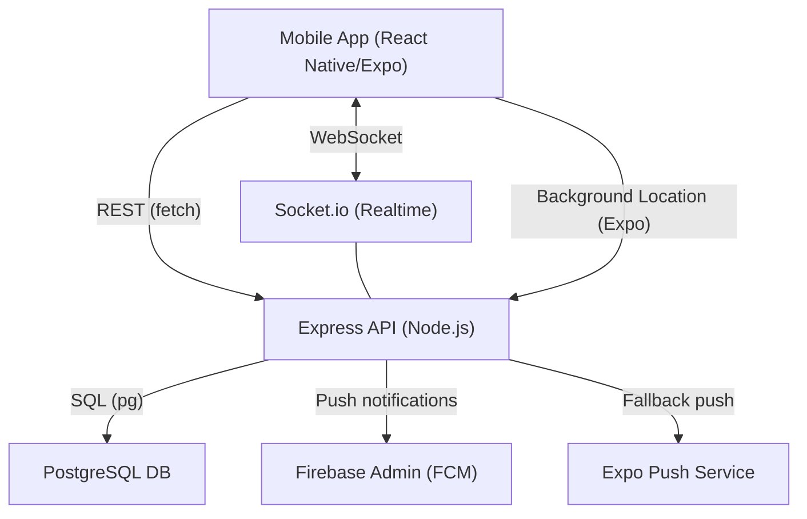
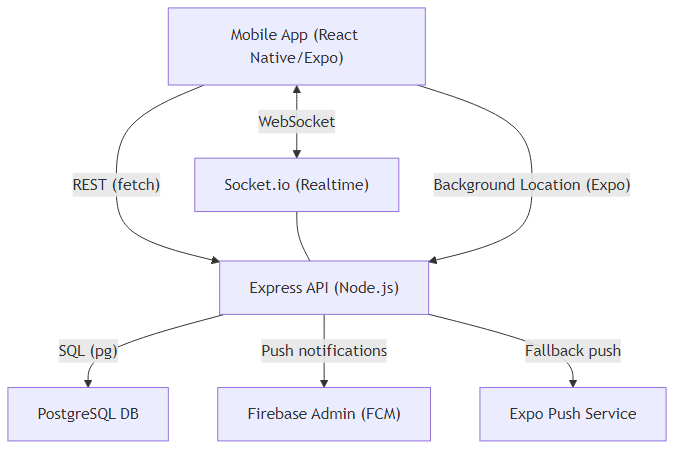

# Project Setup Guide

## Project Overview

This project consists of:
- **frontend/**: React Native (Expo) mobile app
- **my-api/**: Node.js/Express backend API
- **PostgreSQL**: Database (with triggers for location history)
- **Real-time**: Uses socket.io for live updates
- **Expo Sensors**: For device heading (compass)
- **Firebase**: (Optional) for notifications/auth

---

## Architecture Diagram



### Image


---

## Step-by-Step Setup Instructions

### 1. Prerequisites

- **Node.js** (v16+ recommended)
- **npm** (comes with Node.js) or **yarn**
- **PostgreSQL** (know your username, password, and port)
- **Git** (to clone the repo)
- **Expo CLI** (for React Native app)
- **Android Studio/Xcode** (for emulators, or use a physical device)
- **(Optional) Firebase account** (if using notifications/auth)

---

### 2. Clone the Repository

```sh
git clone <your-repo-url>
cd <your-repo-folder>
```

---

### 3. Set Up the Backend (API)

```sh
cd my-api
```

#### a. Install dependencies
```sh
   npm install
   ```

#### b. Configure Environment Variables
- Create a `.env` file in `my-api/` with:
  ```
  PGHOST=localhost
  PGUSER=your_db_user
  PGPASSWORD=your_db_password
  PGDATABASE=your_db_name
  PGPORT=5433
  PORT=3001
  ```
- Replace values as needed.

#### c. Set Up the Database
- Ensure PostgreSQL is running.
- Create the database and tables (run provided SQL scripts if any).
- Make sure triggers for location history are set up if needed.

#### d. Start the Backend
```sh
node index.js
```
- The server should say: `Server running on http://localhost:3001`

---

### 4. Set Up the Frontend (Mobile App)

```sh
cd ../frontend
```

#### a. Install dependencies
```sh
npm install
```

#### b. Install Expo CLI (if not already)
```sh
npm install -g expo-cli
```

#### c. Install Expo Sensors
```sh
expo install expo-sensors
```

#### d. Update Expo to the Required Version
```sh
npm install expo@53.0.20
```

#### e. Configure API URL
- In `frontend/services/api.js`, set `API_BASE_URL` to your computer’s local IP (not `localhost`), e.g.:
  ```js
  const API_BASE_URL = 'http://192.168.1.100:3001/api';
  ```
- Make sure your phone/emulator is on the same WiFi network.

#### f. Start the App
```sh
expo start
```
- Scan the QR code with your phone (Expo Go app) or run on an emulator.

---

### 5. (Optional) Set Up Firebase

- If using Firebase, follow the instructions in `frontend/firebase-config.js` and add your Firebase project credentials.

---

### 6. Common Issues & Troubleshooting

- **Network errors:** Use your local IP, not `localhost`, in API URLs.
- **Port conflicts:** Make sure nothing else is running on ports 3001 (backend) or 5433 (Postgres).
- **Database errors:** Ensure your tables and triggers are set up as per the schema.
- **Permissions:** Allow location and motion permissions on your device.
- **Expo version mismatch:** Run `npm install expo@53.0.20` in the frontend directory.

---

## Summary Table

| Step                | Command/Action                                 |
|---------------------|------------------------------------------------|
| Clone repo          | `git clone ...`                                |
| Backend deps        | `cd my-api && npm install`                     |
| Backend env         | Create `.env` with DB credentials              |
| Backend start       | `node index.js`                                |
| Frontend deps       | `cd ../frontend && npm install`                |
| Expo CLI            | `npm install -g expo-cli`                      |
| Expo Sensors        | `expo install expo-sensors`                    |
| Expo version        | `npm install expo@53.0.20`                     |
| API URL config      | Set local IP in `services/api.js`              |
| Frontend start      | `expo start`                                   |

---

## What to Share with New Developers

- This step-by-step guide (add to your README!)
- The `.env.example` file (with instructions to fill in)
- Any SQL scripts for database setup
- The local IP setup tip for API URLs

---

**If you have any issues, check the troubleshooting section above or ask your team lead for help!** 

---

## 7. Background Location Tracking (Expo/React Native)

### How It Works
- The app fetches and updates the user's location in the background (even when using other apps) using Expo's background location APIs.
- This requires special permissions and a custom build (not Expo Go).

### Permissions Required
- **Android:**
  - `ACCESS_FINE_LOCATION`
  - `ACCESS_COARSE_LOCATION`
  - `ACCESS_BACKGROUND_LOCATION`
- **iOS:**
  - `NSLocationWhenInUseUsageDescription`
  - `NSLocationAlwaysAndWhenInUseUsageDescription`

These are already set in `frontend/app.json`.

### Building a Custom Dev Client or APK

**Expo Go does NOT support background location.**
You must use a custom dev build or production APK.

#### a. Install EAS CLI
```sh
npm install -g eas-cli
```

#### b. Install Yarn (if not already)
```sh
npm install -g yarn
```

#### c. Install Required Packages (in frontend)
```sh
cd frontend
npx expo install expo-task-manager expo-location
```

#### d. Build a Custom Dev Client (for testing background features)
```sh
cd frontend
eas build --profile development --platform android
```
- If prompted, allow EAS to install `expo-dev-client`.
- If you get a yarn error, install yarn globally or use npm to install `expo-dev-client`:
  ```sh
  npm install expo-dev-client@~5.2.4
  ```

#### e. Build a Production APK
```sh
cd frontend

### Troubleshooting
- **Expo Go limitation:** Background location will NOT work in Expo Go.
- **Yarn errors:** Install yarn globally (`npm install -g yarn`) or use npm as above.
- **Permissions:** Make sure you grant "Allow all the time" (Android) or "Always" (iOS).
- **Battery optimization:** Disable for your app on Android.
- **Logs:** Use `adb logcat` (Android) to debug background tasks.

--- 
eas build --platform android
```

#### f. Install APK on your device and test
- Grant all location permissions ("Allow all the time").
- Move the app to the background and verify location updates are sent to the backend.
- On Android, disable battery optimization for your app.

Tech Stack used in these application
--------------------------------------
Frontend (React Native/Expo)
React: 19.0.0
React Native: ^0.79.5
Expo SDK: ^53.0.20
Navigation: @react-navigation/native ^7.1.9, @react-navigation/bottom-tabs ^7.3.13, @react-navigation/stack ^7.3.2
Async storage: @react-native-async-storage/async-storage 2.1.2
Networking: @react-native-community/netinfo ^11.4.1
Location/Tasks: expo-location ~18.1.6, expo-task-manager ~13.1.6
Notifications (client): expo-notifications ^0.31.4
Maps: react-native-maps ^1.20.1, react-native-web-maps ^0.3.0, Google Places react-native-google-places-autocomplete ^2.5.7
UI: react-native-paper ^5.14.1, react-native-vector-icons ^10.2.0, gesture/safe-area/screens aligned with Expo SDK
Realtime: socket.io-client ^4.8.1
Firebase (client SDK): firebase ^11.10.0
i18n: i18n-js ^4.5.1
Misc: date-fns ^4.1.0, papaparse ^5.5.2, react-native-fs ^2.20.0, react-native-reanimated ~3.17.4
Dev tooling: @expo/cli ^0.24.13, @babel/core ^7.26.0, typescript ~5.8.3, @types/react ~19.0.10

Backend (Node/Express)
Node.js: v16+ recommended (README)
Express: ^5.1.0
Socket.io: ^4.8.1
PostgreSQL driver (pg): ^8.16.3
CORS: ^2.8.5
dotenv: ^17.0.1
bcrypt: ^6.0.0
uuid: ^11.1.0
firebase-admin: ^12.7.0 (push notifications via FCM)

